# HomeCare+ — Tenant Operator Guide

A step-by-step walkthrough of every screen in your HomeCare+ admin dashboard. Use it when you set up a new home-care service, train a new operator, or look up how a specific page works.

> **What HomeCare+ is for.** HomeCare+ delivers care **at the patient's home** — your nurses, physiotherapists, and doctors visit patients where they live. This dashboard is where you set up your service, configure your providers (with the **areas they cover**), watch incoming requests, send invoices, run promotions, and pay your team. The patient app and the doctor app handle the actual booking and the visit; this dashboard is the back office.

---

## Table of contents

1. [Signing in](#1-signing-in)
2. [Choosing your service](#2-choosing-your-service)
3. [Getting started checklist](#3-getting-started-checklist)
4. [Dashboard (analytics)](#4-dashboard-analytics)
5. [Providers & Staff](#5-providers--staff)
   - [Providers (doctors / nurses)](#51-providers-doctors--nurses)
   - [Specialities](#52-specialities)
   - [Ratings](#53-ratings)
6. [Service Units](#6-service-units)
   - [Clinics](#61-clinics)
   - [Medical Centers](#62-medical-centers)
7. [Patients & Visits](#7-patients--visits)
   - [Patients](#71-patients)
   - [Visits](#72-visits)
8. [Pricing](#8-pricing)
   - [Provider levels](#81-provider-levels)
   - [Prices](#82-prices)
9. [Integrations](#9-integrations)
   - [Apps](#91-apps)
   - [Messages](#92-messages)
10. [Money](#10-money)
    - [Invoices](#101-invoices)
    - [Insurance Claims](#102-insurance-claims)
    - [Payouts](#103-payouts)
    - [Provider Settings](#104-provider-settings)
11. [Marketing](#11-marketing)
    - [Coupons](#111-coupons)
    - [Banners](#112-banners)
12. [Team Administration](#12-team-administration)
    - [Users](#121-users)
13. [Forgot your password?](#13-forgot-your-password)
14. [Quick tips](#14-quick-tips)

---

## 1. Signing in

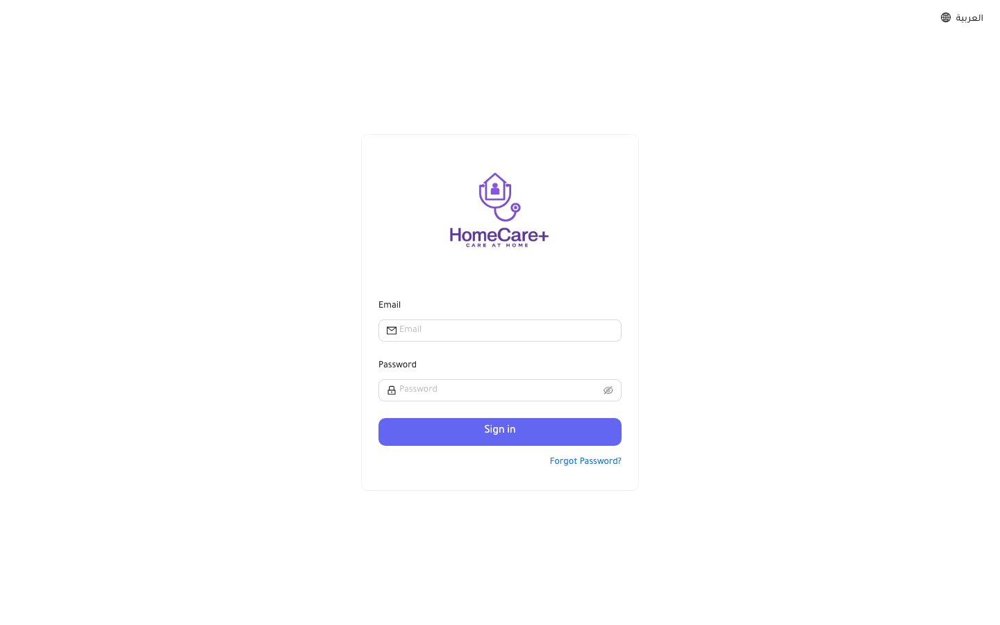

- Open **https://homecare.codelines.sa/system** in your browser (this is the same address for every HomeCare+ customer).
- Type your **email** and **password**, then click **Sign in**.
- The globe icon in the top right switches the dashboard between English and العربية. Everything translates instantly, and Arabic flips the layout right-to-left automatically.
- Forgot your password? Click **Forgot Password?** under the form. See [section 13](#13-forgot-your-password).
- After you reset your password, you'll see a green confirmation banner the next time you sign in.

---

## 2. Choosing your service

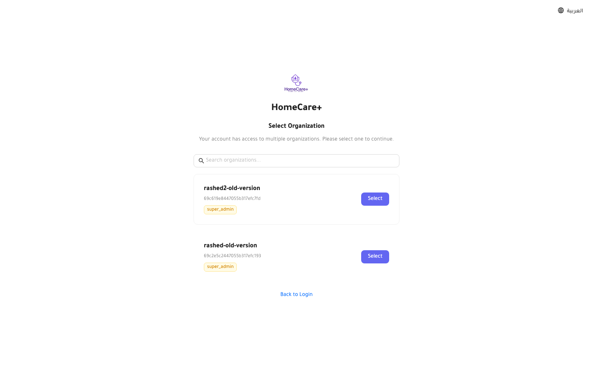

If your account is linked to more than one service brand or franchise, this screen appears right after sign-in.

- Each card shows the **service name**, an **ID**, your **role** (badge in yellow / red / blue), and the **medical centers** you can see.
- Type into the **search box** to filter the list.
- Click **Select** on the service you want to work in. The dashboard reloads with that service's data.
- **Back to login** signs you out and returns to the sign-in screen.

Once selected, your choice is remembered for the rest of your session. To switch later, use the dropdown at the **top-right of every page**.

---

## 3. Getting started checklist

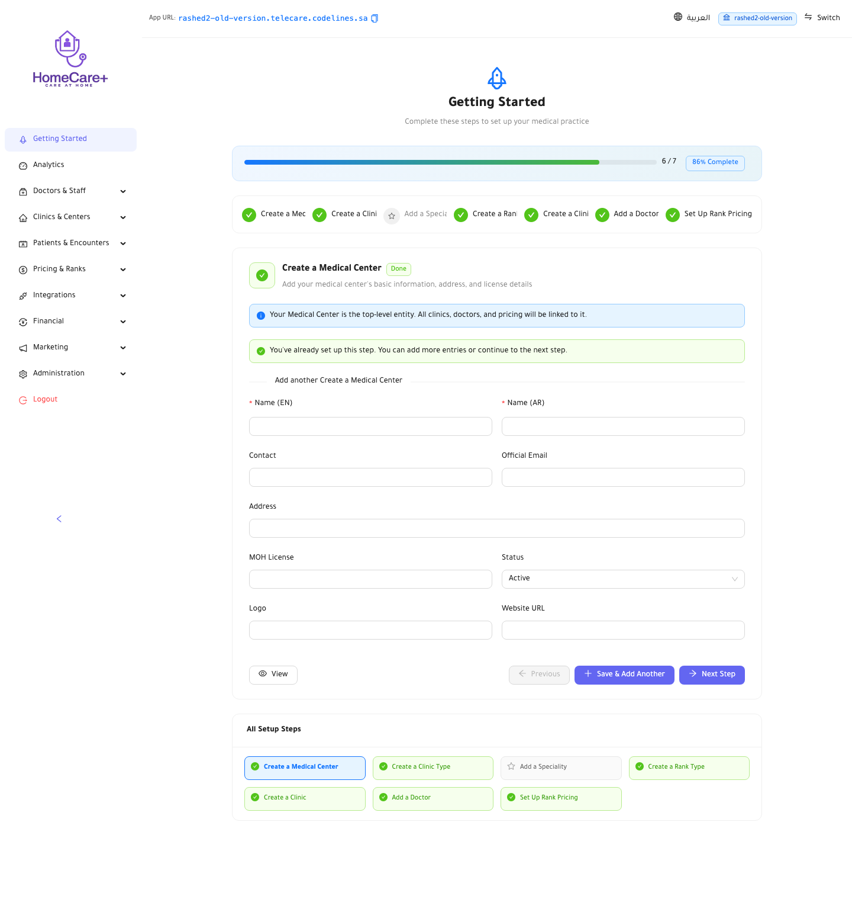

A new service always lands here first. The checklist walks you through the eight things that have to be in place before patients can book a visit.

| Order | Step | What you fill in |
|-----:|------|------------------|
| 1 | **Medical Center** | English + Arabic name, MOH license, contact details, address |
| 2 | **Clinic Type** | "Home Care", "Wound Care", "Geriatric"… the kind of service unit |
| 3 | **Speciality** | Specific specialities each provider practices |
| 4 | **Provider Level** | Consultant, Specialist, Nurse — the seniority tiers you charge for |
| 5 | **Consultation Type** | "Home Visit", "Follow-up Call"… the kinds of visits you offer |
| 6 | **Clinic** | A real service unit = clinic type + medical center |
| 7 | **Provider** | Each doctor / nurse with name, gender, clinic, level, speciality, and **service area** |
| 8 | **Price** | How much each (level × clinic × visit type) costs |

- The **progress bar** at the top shows how many of the eight steps are done (e.g. "3 / 8").
- **Save and Continue** moves to the next step. **Save and Add Another** lets you add several entries in a row (multiple providers, multiple prices…).
- **Skip** lets you come back later — every step has its own page in the sidebar.
- **View** opens the full list for that section so you can double-check what you've entered.
- When every required step is done, a success card appears with a **Go to Dashboard** button.

> You can revisit the checklist any time from **Getting Started** in the left sidebar.

---

## 4. Dashboard (analytics)

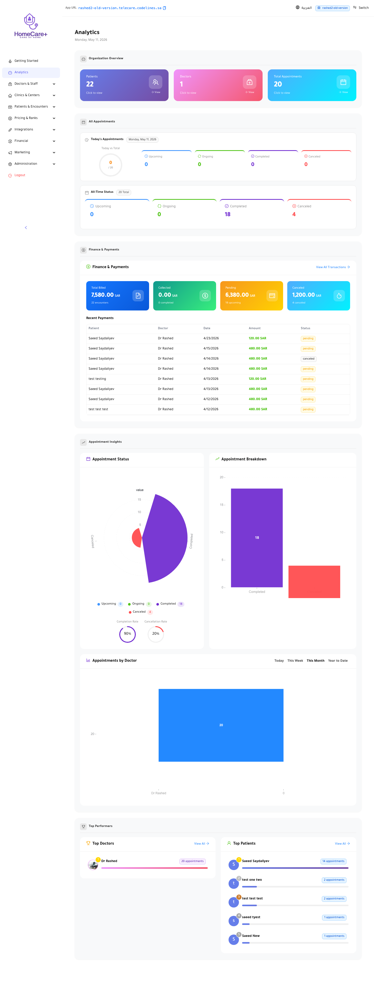

Your daily homepage. Numbers update live as your team and your patients use the system.

Reading the page from top to bottom:

1. **Overview** — three big clickable cards: total **Patients**, **Providers**, and **Visits**. Click any of them to open that full list.
2. **All Visits** — today versus all-time, broken into **Upcoming / Ongoing / Completed / Canceled** so you can see how today is shaping up.
3. **Finance & Payments** — four cards (**Total Billed**, **Collected**, **Pending**, **Canceled**) followed by a list of recent payments. The **View All Transactions** link jumps to the payouts page.
4. **Visit Insights** — two charts: a circular "rose" chart of status distribution, and a column chart for breakdown.
5. **Visits by Provider** — a bar chart showing your busiest providers. The **Today / This Week / This Month / Year to Date** buttons change the time window. Useful for scheduling, bonuses, and vacation planning.
6. **Top Performers** — leaderboards of your **Top Providers** and **Top Patients** with gold / silver / bronze badges. Click a row to open that person's profile.

---

## 5. Providers & Staff

### 5.1 Providers (doctors / nurses)

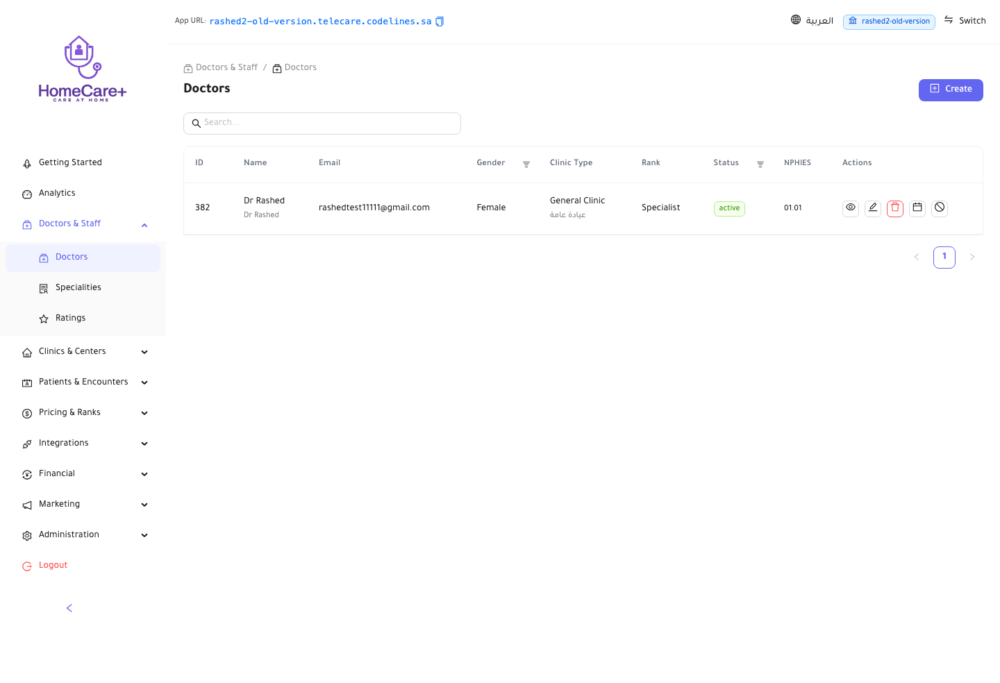

The full list of everyone who delivers home visits. Each row shows the provider's ID, name (English + Arabic), email, gender, clinic type, level, status, and a flag for whether their insurance code is filled in.

- Use the small dropdowns on the column headers to **filter by gender** or **status** (Active / Inactive).
- The buttons at the end of each row do the following:
  - **Eye icon** — view the provider's full profile.
  - **Pencil icon** — edit their details.
  - **Trash icon** — remove them (you'll be asked to confirm).
  - **📅 Calendar icon** — set their **working hours** (when they're available for visits).
  - **🌴 Suitcase / palm icon** — set their **vacation days** (when they're unavailable).
- A small ⚠️ icon next to a provider means an **insurance code (NPHIES practice code) is missing**. Insurance claims won't go through without it.

#### Adding a new provider

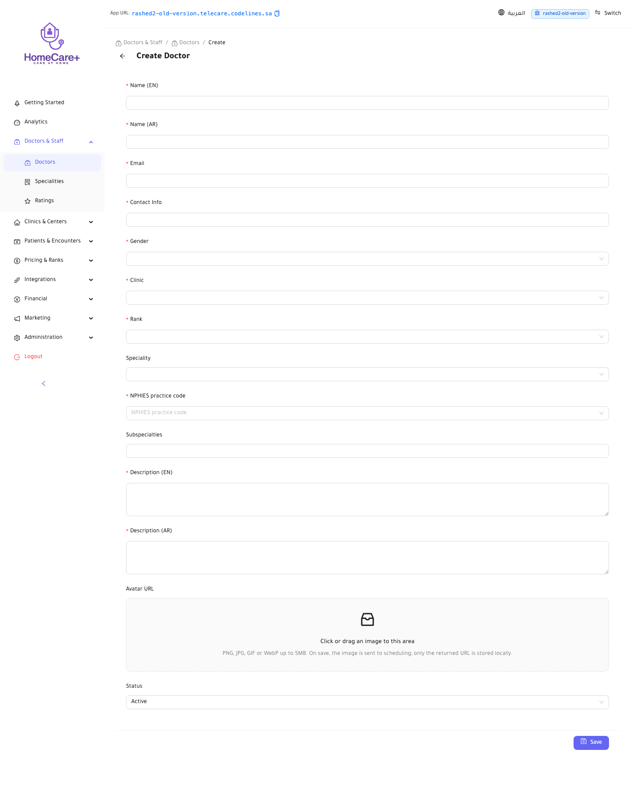

Fields you fill in:

- **Name (English)** and **Name (Arabic)**.
- **Email**, **Contact info** (phone), **Gender**.
- **Clinic**, **Provider Level**, **Speciality** — picked from the dropdowns you set up earlier.
- **Insurance practice code (NPHIES)** — required only if you submit insurance claims.
- **Subspecialties**, **Description** (English + Arabic), **Avatar** photo, **Status** (Active / Inactive).
- **Location section** — this is the most important part for HomeCare+. Use the embedded map to:
  - **Pin** the provider's base location (where they start their day from).
  - **Address** auto-fills from the pin.
  - **Service radius (km)** — how far they're willing to travel for a visit.

> Patients only see providers whose service radius covers their address. **A pin in the wrong spot or a radius that's too small means missed bookings.** Recommend reviewing each provider's pin and radius every quarter — staff move, traffic patterns change.

### 5.2 Specialities

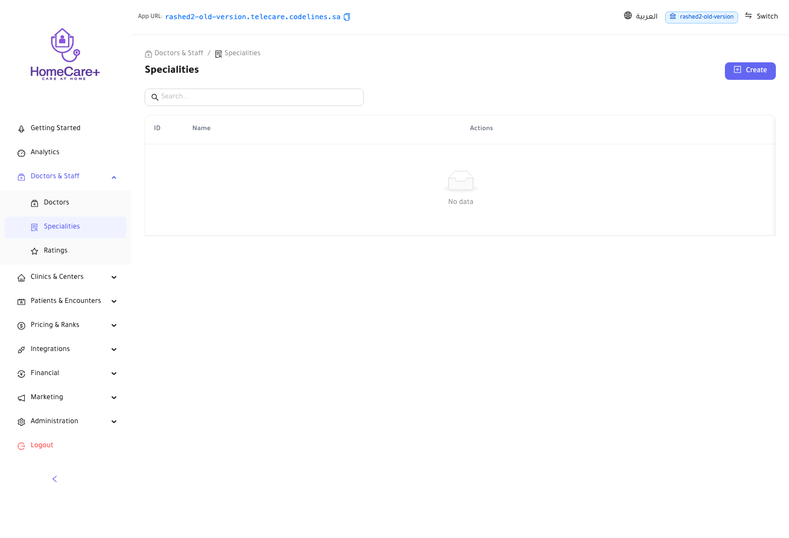

The list of services you offer. The patient app uses this list when patients filter for the kind of provider they need (wound care, geriatric care, IV therapy…).

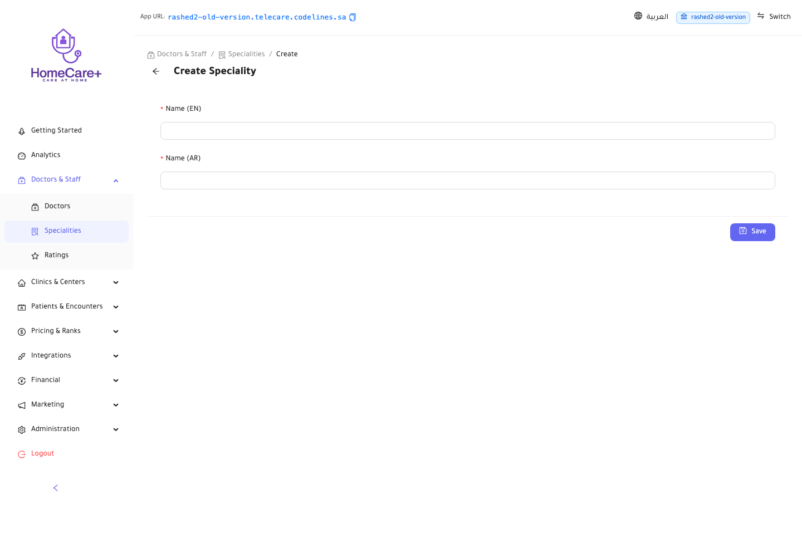

- Just two fields: **Name (English)** and **Name (Arabic)**.
- Add one entry for every service your providers cover.

### 5.3 Ratings

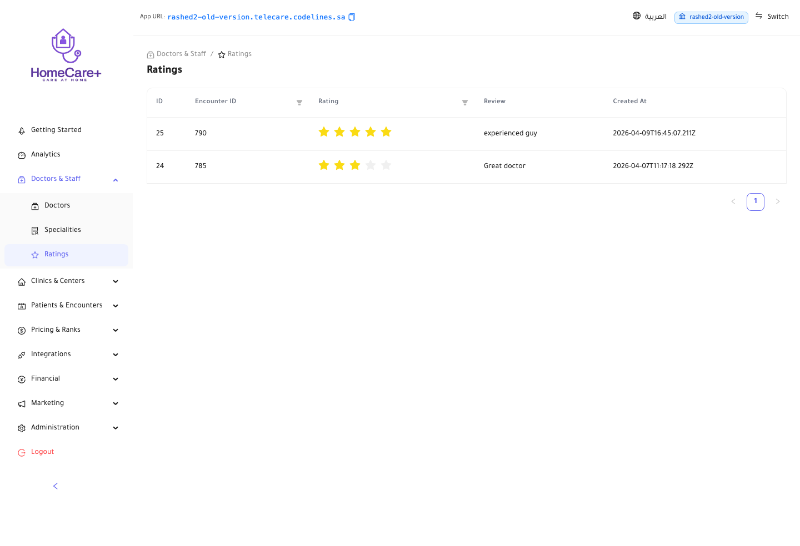

What patients said after their visits. Each row shows the visit ID, the star rating, the patient's review text, and the date.

- Use the column filters to find ratings for a particular visit or score.
- This screen is **read only** — patients submit the reviews, and you can read but not change them.

For home care, ratings are your main signal for **field experience** — punctuality, hygiene, manner. Watch for trends, not single reviews.

---

## 6. Service Units

### 6.1 Clinics

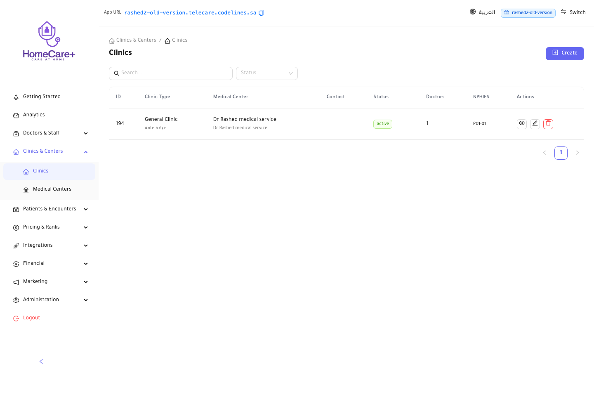

A "clinic" is one service unit inside a medical center — for example "Home Care — Riyadh North". Each row shows the clinic type, the medical center it belongs to, contact number, status, provider count, and insurance code status.

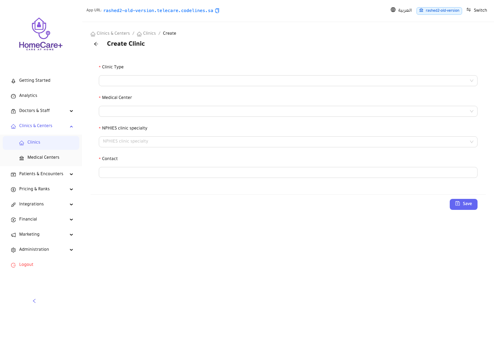

- **Clinic type** — pick from the list you created during setup.
- **Medical center** — the parent facility.
- **Insurance specialty code** — used when sending claims.
- **Contact number** — usually the dispatch line.

The buttons on each row let you **view**, **edit**, or **delete** the clinic.

### 6.2 Medical Centers

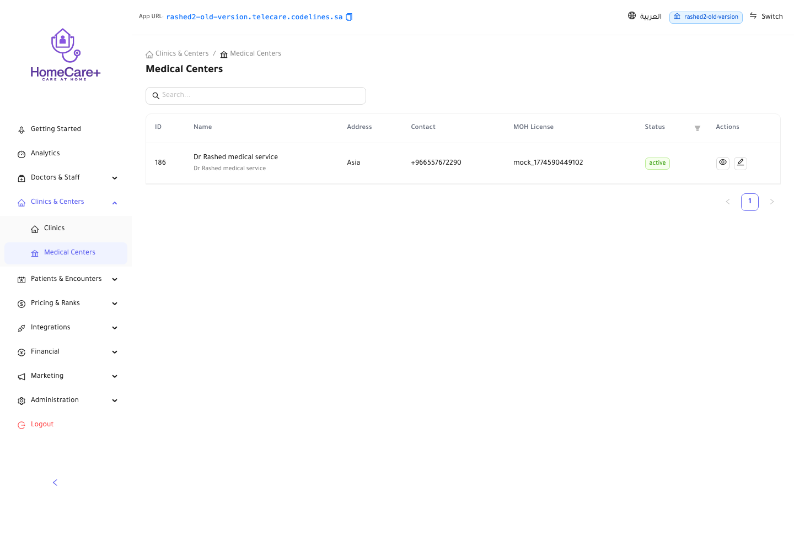

The top-level facilities under your account — usually one per city / branch.

- The list shows the bilingual name, address, contact, MOH license number, and status.
- Edit a center to update its name (English + Arabic), address, MOH license, official phone, official email, website, logo, **digital stamp** (used on printed prescriptions and lab orders), location, and status.

> The medical center is what links your service to **MOH licensing** and **NPHIES** (insurance). The **digital stamp** is what makes your prescriptions and reports official. Keep both up to date.

---

## 7. Patients & Visits

### 7.1 Patients

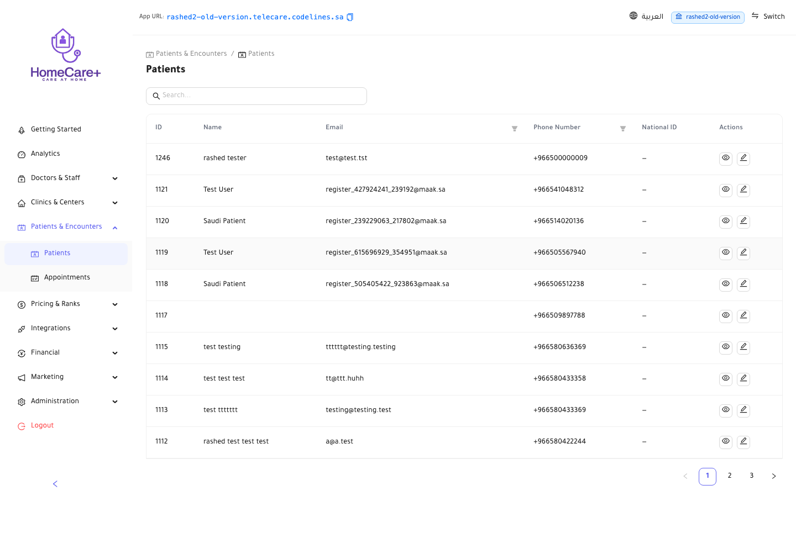

Everyone who has registered or been registered for a home visit.

- Columns: ID, English name, email, phone, national ID.
- Filter by email or phone with the small column dropdowns; the top **search** does a free-text match across name and contact info.
- Click the **eye icon** to see the full profile, or the **pencil icon** to edit name, email, phone, national ID, or add a free-form note (e.g. "patient prefers female nurse", "patient is on the 3rd floor — no elevator").

> Patients register themselves through the patient mobile app. The dashboard is mostly for viewing — keep your edits limited to corrections and useful notes.

### 7.2 Visits

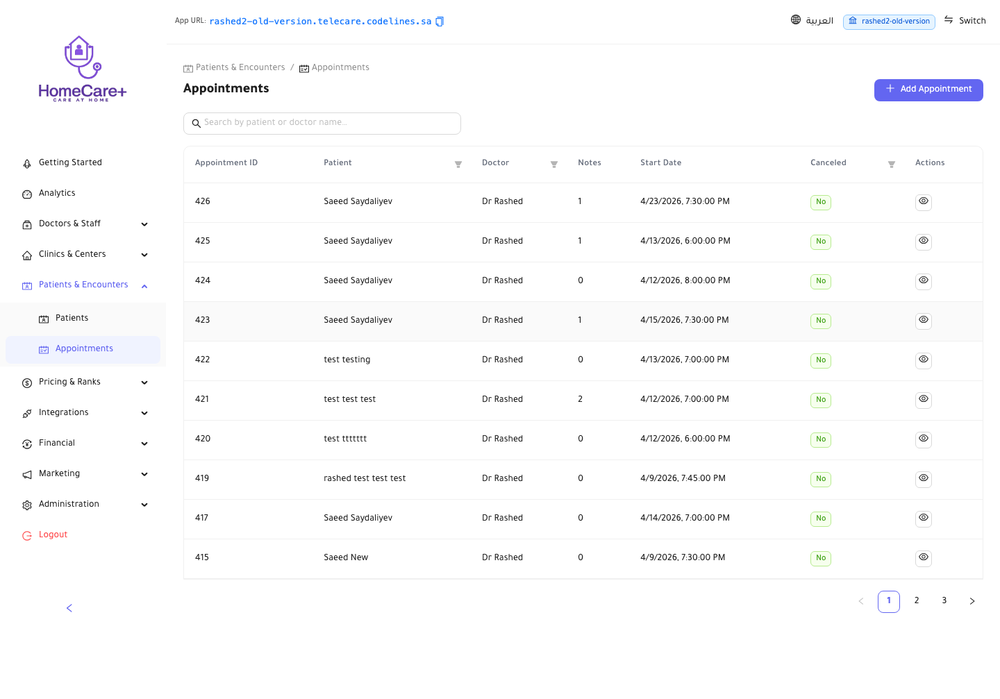

Every booking — past, present, and future. The list shows ID, patient name, provider name, the number of clinical notes on file, start time, and whether it's canceled.

- Filter by patient, provider, or status (Confirmed / Canceled) using the column dropdowns. The top **search** finds visits by patient or provider name.
- **+ Add Appointment** opens a window where you can pick an available provider and book a slot on their calendar on the patient's behalf.
- Click a visit to open its **details page**. From there you can:
  - **View Booking Details** — see the full booking record, **including the patient's address** for that visit.
  - **Reschedule** — open the provider's calendar pre-set to this visit so you can pick a new slot.
  - **Cancel Booking** — type a reason and confirm.
  - **Prescriptions** and **Lab Investigations** tabs — see what the provider prescribed or ordered during the visit.

> When rescheduling, always **double-check the patient's address with them** — addresses can change between bookings (e.g. patient went to stay with relatives).

---

## 8. Pricing

### 8.1 Provider levels

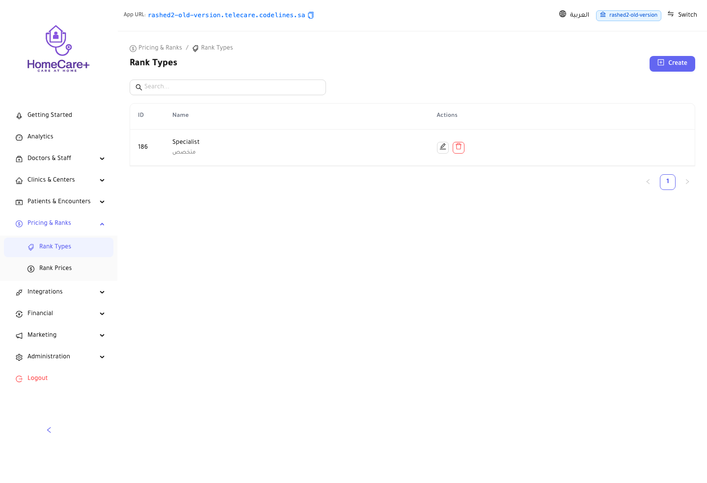

The seniority tiers you charge differently for — for example Consultant, Specialist, Nurse, Physiotherapist.

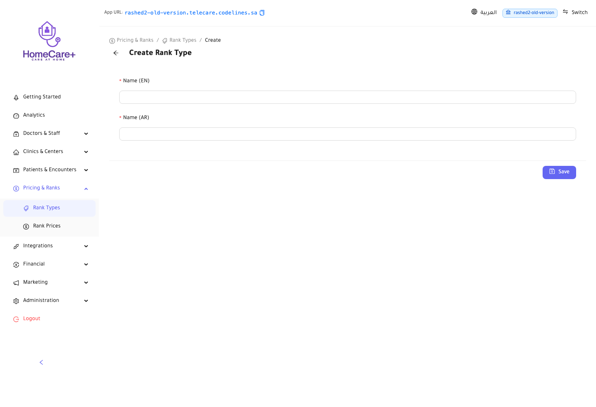

- Fields: **Name (English)** and **Name (Arabic)**. Nothing else.

### 8.2 Prices

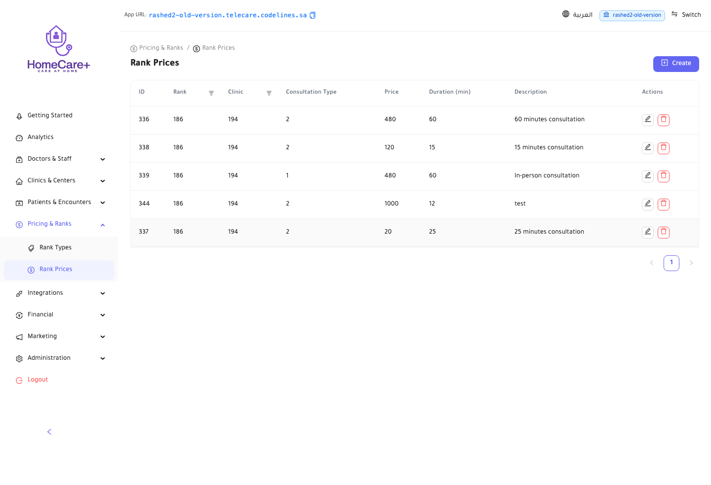

The price list: one entry per (provider level × clinic × visit type). For example, "Wound care nurse — home visit — 45 minutes — 220 SAR".

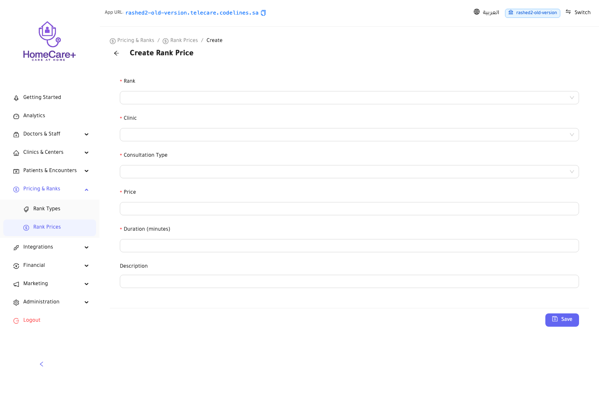

- **Provider Level**, **Clinic**, **Visit Type** — pick from the dropdowns.
- **Price** in your currency.
- **Duration (minutes)** — how long the visit takes. This sets the slot length on the provider's calendar.
- **Description** — what the patient sees next to the price in the booking app.

> Some services are set up so the patient just picks the cheapest available provider (without choosing a level). On those services the **Provider Level** field is hidden — the system picks automatically. That's common for home care, where several nurses can do the same wound dressing at different price points.

---

## 9. Integrations

These two pages let you configure parts of the booking platform that power your patient and provider apps. The first time you open one, give it a few seconds to load.

### 9.1 Apps

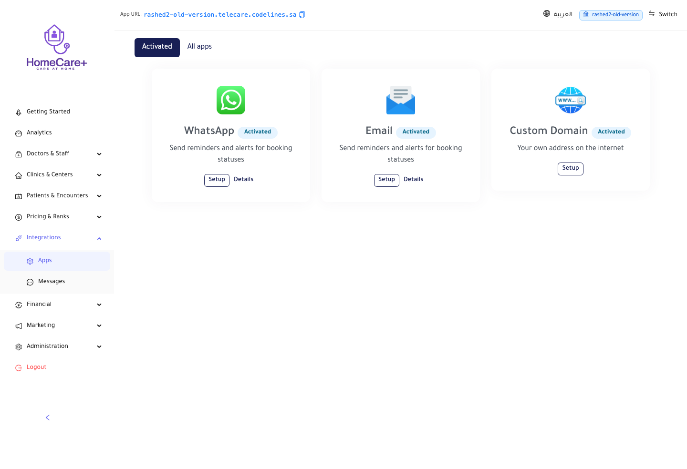

Turn on or off the **add-ons** that extend your service — for example payment providers, notification channels, or custom integrations.

### 9.2 Messages

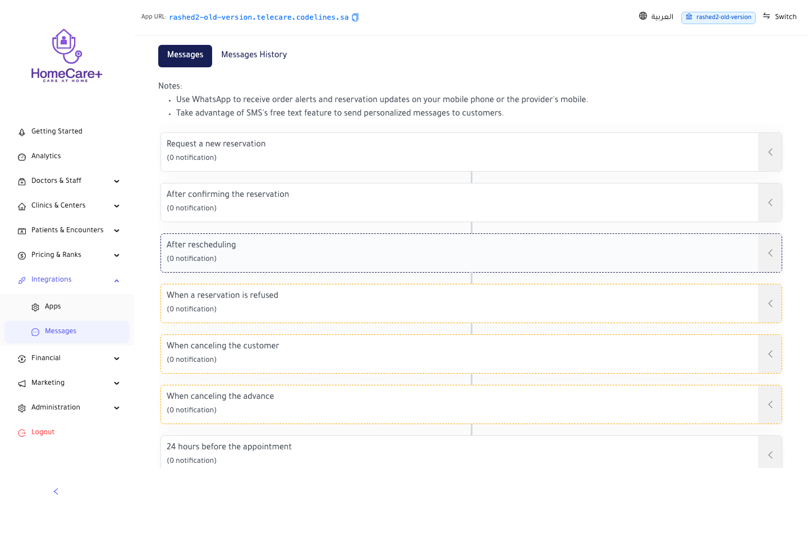

Set up the **SMS, email, and WhatsApp templates** your service sends. For home care, this is where you configure **arrival notifications** ("Your nurse is 10 minutes away"), reminders, and confirmations.

---

## 10. Money

### 10.1 Invoices

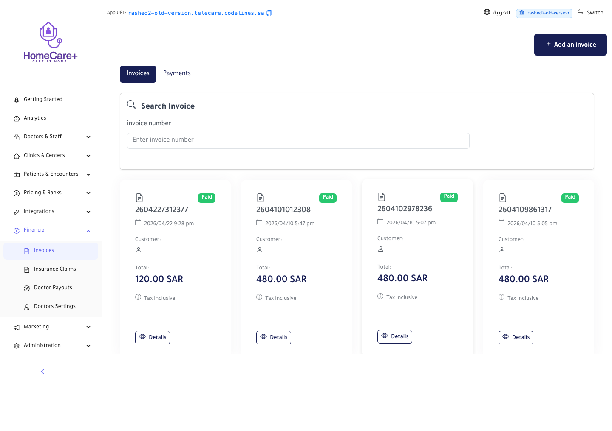

Issue invoices, view what's paid and what's still pending, and attach invoices to visits.

### 10.2 Insurance Claims

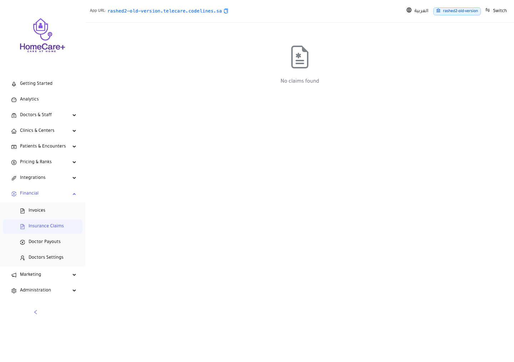

Submit and track insurance claims through the Saudi national health insurance network (NPHIES) — eligibility checks, pre-authorizations, and reimbursements.

> Claims won't work without two things: the provider's **insurance practice code** and the clinic's **insurance specialty code**. The ⚠️ icons on the Providers and Clinics lists tell you which ones are missing.

### 10.3 Payouts

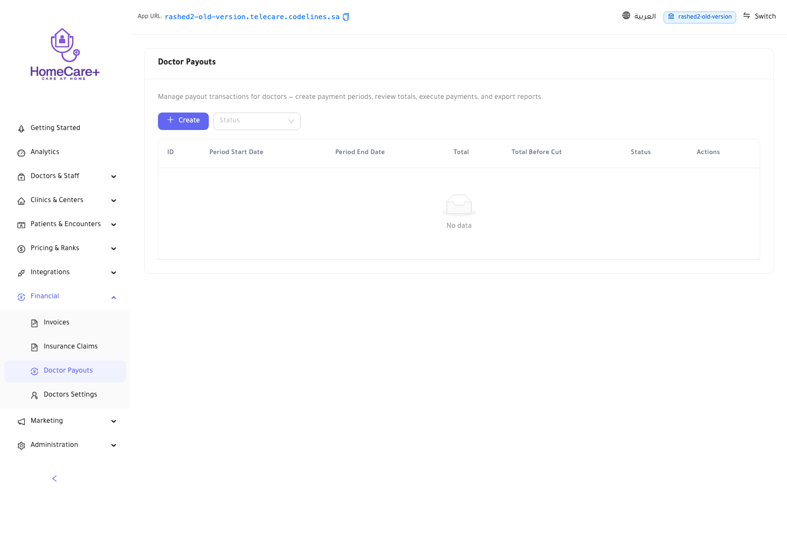

Batch payments to your providers. Each row is one payout for a date range.

- Columns: ID, period start, period end, total, total before your cut, status.
- **Status** is one of Draft, Processing, Completed, Failed, or Cancelled. Use the filter to narrow down. Click **Load More** for older batches.
- **Create** opens a window where you pick the start and end dates and creates a **draft** payout.
- Click a row to open the details:
  - **Execute** — only available for draft batches; this actually sends the money.
  - **Cancel** — only available for draft batches.
  - **Export Excel** — completed batches can be exported as a spreadsheet.

### 10.4 Provider Settings

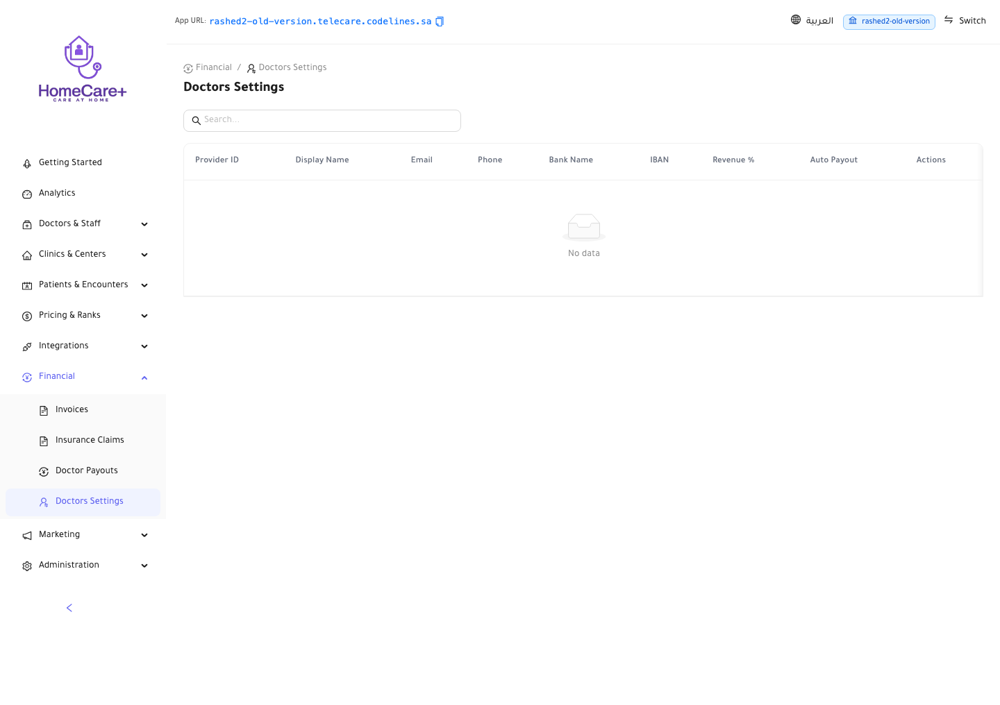

The payment setup for each provider.

- Columns: ID, name, email, phone, bank name, IBAN, your revenue share, and whether payouts run automatically.
- Edit a row to set:
  - **Bank Full Name** and **IBAN** — where the money goes.
  - **Revenue Percentage** — the share each provider takes home (between 0 and 1; for example **0.6** means **60%** to the provider and **40%** to the service).
  - **Automated Payout** — turn on if you want payouts to fire automatically at the end of each period.

Providers appear here automatically once you've added them; you don't add or remove entries from this page directly.

---

## 11. Marketing

### 11.1 Coupons

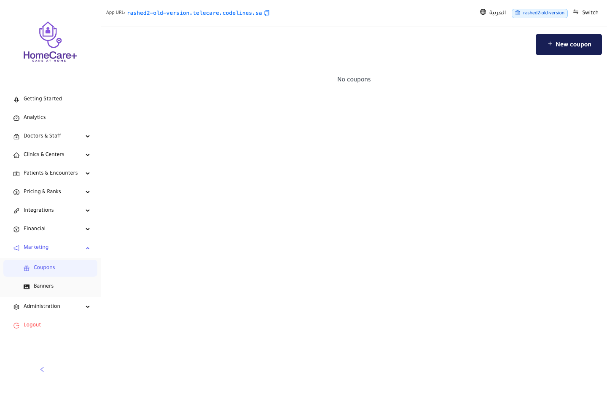

Create discount codes — set the amount, the dates they're valid, and which clinics or services they apply to. Useful for first-visit offers, seasonal campaigns, and loyalty rewards.

### 11.2 Banners

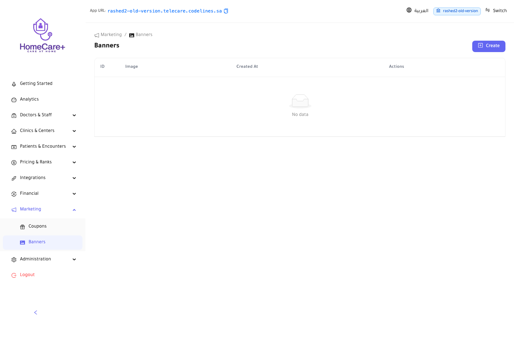

The big promotional images on the patient app's home screen.

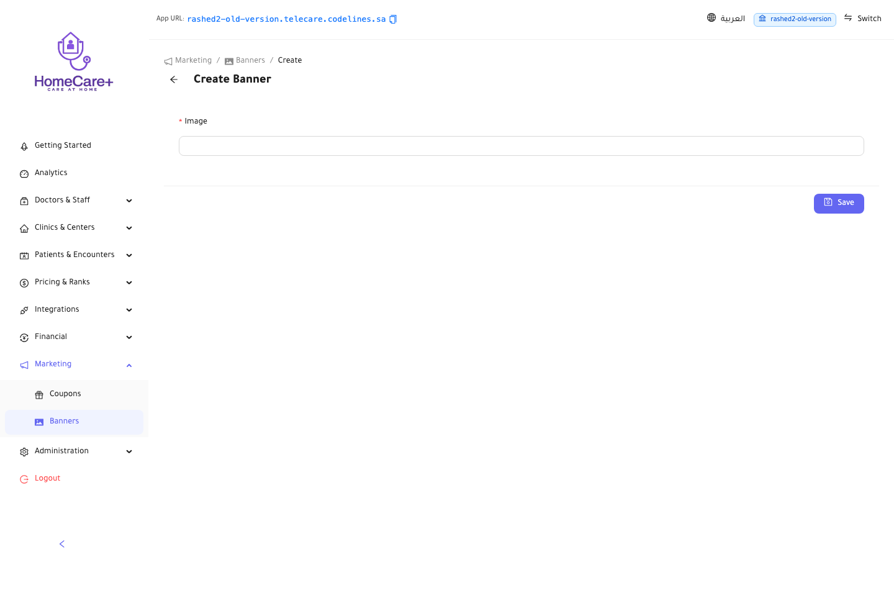

- One field: **Image URL**.
- The list shows a thumbnail of each banner. To reorder, delete and re-add — the latest banner appears last.
- Use it for campaigns, seasonal offers ("Ramadan home care offer"), service launches, or announcements.

---

## 12. Team Administration

### 12.1 Users

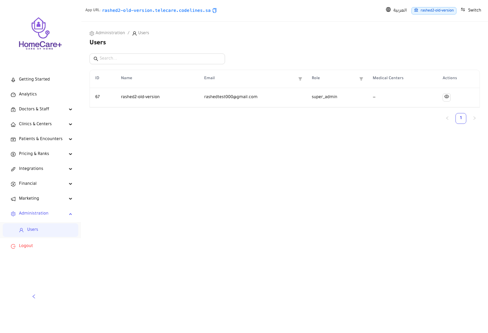

Your team — everyone who can sign into this dashboard (dispatchers, supervisors, managers).

- Columns: name, email, role, and the medical centers they can access.
- The top **search** finds people by name; the column filters narrow by email or role.
- Click the **eye icon** to see a user's full profile.

> This page is **view only**. To invite a new admin or revoke an existing one, contact Codelines support. The roles you'll see are:
>
> - **Owner (root_admin)** — full access across the whole service.
> - **Manager (super_admin)** — manages a group of medical centers.
> - **Center admin (medical_center_admin)** — limited to one specific medical center. Useful when you run multiple city branches.

---

## 13. Forgot your password?

### Step 1 — Request a reset link

- From the sign-in page, click **Forgot Password?**.
- Type your email and submit. You'll see a confirmation message; an email with a reset link will arrive in your inbox.

### Step 2 — Set a new password

- Open the link in your email — it takes you to a page with two boxes: **new password** and **confirm**.
- Pick a password at least **6 characters** long, type it twice, and submit.
- You'll be sent back to the sign-in page with a green confirmation banner.

If the link in your email says "invalid token", request a new one from the Forgot Password page.

---

## 14. Quick tips

- **English ↔ Arabic anywhere.** The globe icon in the top-right switches the whole dashboard between languages and flips the layout for Arabic.
- **Switch between services.** The dropdown at the top-right of every page lists the services your account can access.
- **Patient app URL.** The top of every page (left of the header) shows the public address of your patient-facing app, with a copy button next to it. Useful when training dispatchers or sharing the link with patients.
- **Unsaved changes.** If you edit something and try to leave the page without saving, the dashboard will ask you to confirm.
- **Location is everything.** Patients only see providers whose service radius covers their address. If bookings are slow, audit your provider pins and radii first.
- **Always confirm the visit address.** Especially when rescheduling — patients sometimes book from one place and want the visit at another. The address sits on each visit's booking details page.
- **Where prescriptions and lab orders live.** They're not in the sidebar on their own — your providers create them in their doctor app, and you'll find them on each Visit's details page under the **Prescriptions** and **Lab Investigations** tabs. You can download them as PDFs from there.
- **Watch for the ⚠️ icon.** It always means an insurance code is missing on a provider or clinic. Fill it in before you submit claims.
- **Need help?** Contact Codelines support — they can adjust account access, add team members, or assist with anything you can't do from the dashboard yourself.
