# Telecare Plus — Tenant Operator Guide

A step-by-step walkthrough of every screen in your Telecare Plus admin dashboard. Use it when you set up a new clinic, train a new team member, or look up how a specific page works.

> **What Telecare Plus is for.** Telecare Plus runs both **online consultations** (video, voice, or chat) and **in-person appointments** at your clinic. This dashboard is where you set up your clinics and doctors, watch appointments coming in, send invoices, run promotions, and pay your team. The patient app and the doctor app handle the actual visits and calls; this dashboard is the back office.

---

## Table of contents

1. [Signing in](#1-signing-in)
2. [Choosing your clinic](#2-choosing-your-clinic)
3. [Getting started checklist](#3-getting-started-checklist)
4. [Dashboard (analytics)](#4-dashboard-analytics)
5. [Doctors & Staff](#5-doctors--staff)
   - [Doctors](#51-doctors)
   - [Specialities](#52-specialities)
   - [Ratings](#53-ratings)
6. [Clinics & Centers](#6-clinics--centers)
   - [Clinics](#61-clinics)
   - [Medical Centers](#62-medical-centers)
7. [Patients & Appointments](#7-patients--appointments)
   - [Patients](#71-patients)
   - [Appointments](#72-appointments)
8. [Pricing](#8-pricing)
   - [Doctor levels](#81-doctor-levels)
   - [Prices](#82-prices)
9. [Integrations](#9-integrations)
   - [Apps](#91-apps)
   - [Messages](#92-messages)
10. [Money](#10-money)
    - [Invoices](#101-invoices)
    - [Insurance Claims](#102-insurance-claims)
    - [Payouts](#103-payouts)
    - [Provider Settings](#104-provider-settings)
11. [Marketing](#11-marketing)
    - [Coupons](#111-coupons)
    - [Banners](#112-banners)
12. [Team Administration](#12-team-administration)
    - [Users](#121-users)
13. [Forgot your password?](#13-forgot-your-password)
14. [Quick tips](#14-quick-tips)

---

## 1. Signing in

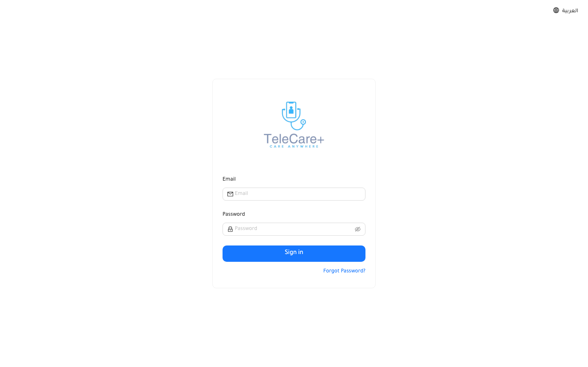

- Open **https://telecare.codelines.sa/system** in your browser (this is the same address for every Telecare Plus customer).
- Type your **email** and **password**, then click **Sign in**.
- The globe icon in the top right switches the dashboard between English and العربية. Everything — menus, labels, buttons — translates instantly, and Arabic flips the layout right-to-left automatically.
- Forgot your password? Click **Forgot Password?** under the form. See [section 13](#13-forgot-your-password).
- After you reset your password, you'll see a green confirmation banner the next time you sign in.

---

## 2. Choosing your clinic

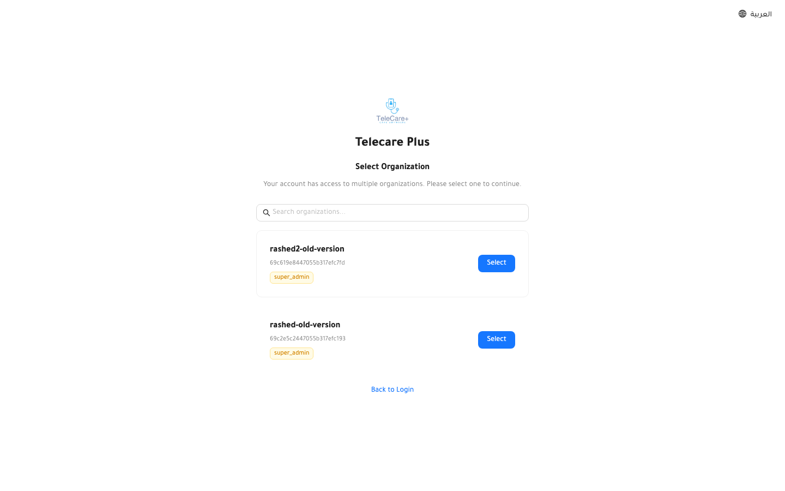

If your account is linked to more than one clinic group (e.g. you manage several brands), this screen appears right after sign-in.

- Each card shows the **clinic name**, an **ID**, your **role** (badge in yellow / red / blue), and the **medical centers** you can see.
- Type into the **search box** to filter the list when you have many entries.
- Click **Select** on the clinic you want to work in. The dashboard reloads with that clinic's data.
- **Back to login** signs you out and returns to the sign-in screen.

Once selected, your clinic is remembered for the rest of your session. To switch later, use the dropdown at the **top-right of every page**.

---

## 3. Getting started checklist

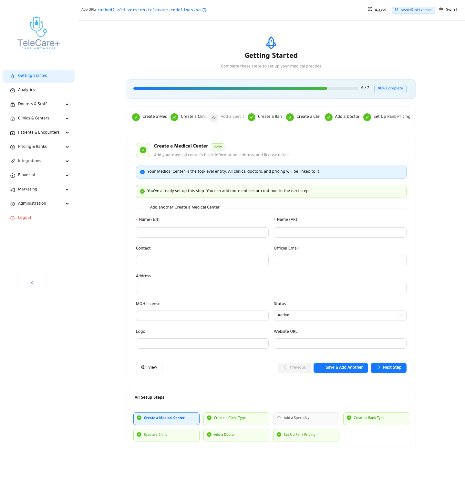

A new clinic always lands here first. The checklist walks you through the eight things that have to be in place before patients can book an appointment.

| Order | Step | What you fill in |
|-----:|------|------------------|
| 1 | **Medical Center** | English + Arabic name, MOH license, contact details, address |
| 2 | **Clinic Type** | "General", "Dermatology", "Cardiology"… the broad category |
| 3 | **Speciality** | Specific specialities each doctor practices |
| 4 | **Doctor Level** | Consultant, Specialist, GP — the seniority tiers you charge for |
| 5 | **Consultation Type** | Video, Voice, Chat, or In-person — how patients can meet doctors |
| 6 | **Clinic** | A real clinic = clinic type + medical center |
| 7 | **Doctor** | Each practitioner with their name, gender, clinic, level, speciality |
| 8 | **Price** | How much each (level × clinic × consultation type) costs |

- The **progress bar** at the top shows how many of the eight steps are done (e.g. "3 / 8").
- **Save and Continue** moves to the next step. **Save and Add Another** lets you add several entries in a row (multiple doctors, multiple prices…).
- **Skip** lets you come back later — every step has its own page in the sidebar.
- **View** opens the full list for that section so you can double-check what you've entered.
- When every required step is done, a success card appears with a **Go to Dashboard** button.

> You can revisit the checklist any time from **Getting Started** in the left sidebar.

---

## 4. Dashboard (analytics)

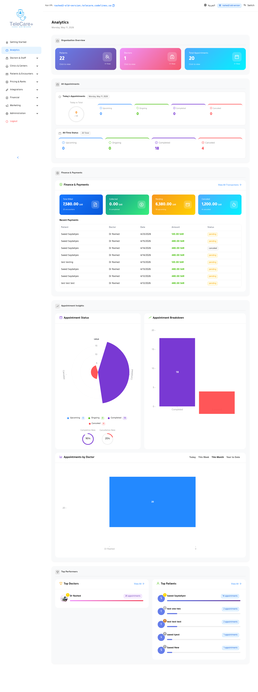

Your daily homepage. Numbers update live as your team and your patients use the system.

Reading the page from top to bottom:

1. **Clinic Overview** — three big clickable cards: total **Patients**, **Doctors**, and **Appointments**. Click any of them to open that full list.
2. **All Appointments** — today versus all-time, broken into **Upcoming / Ongoing / Completed / Canceled** so you can see how today is shaping up.
3. **Finance & Payments** — four cards (**Total Billed**, **Collected**, **Pending**, **Canceled**) followed by a list of recent payments. The **View All Transactions** link jumps to the payouts page.
4. **Appointment Insights** — two charts: a circular "rose" chart of status distribution, and a column chart for breakdown.
5. **Appointments by Doctor** — a bar chart showing your top doctors. The **Today / This Week / This Month / Year to Date** buttons change the time window.
6. **Top Performers** — leaderboards of your **Top Doctors** and **Top Patients** with gold / silver / bronze badges. Click a row to open that person's profile.

---

## 5. Doctors & Staff

### 5.1 Doctors

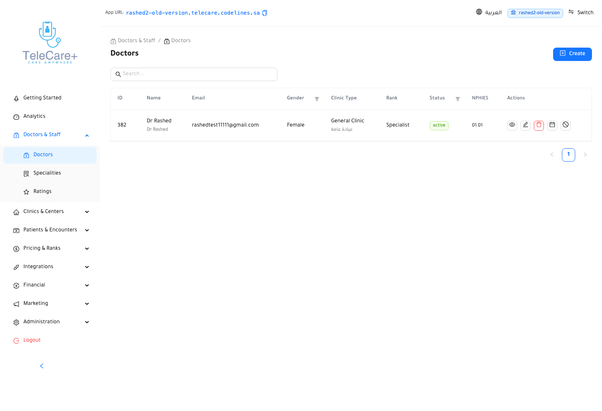

The full list of practitioners. Each row shows the doctor's ID, name (English + Arabic), email, gender, clinic type, level, status, and a flag for whether their insurance code is filled in.

- Use the small dropdowns on the column headers to **filter by gender** or **status** (Active / Inactive).
- The buttons at the end of each row do the following:
  - **Eye icon** — view the doctor's full profile.
  - **Pencil icon** — edit their details.
  - **Trash icon** — remove them (you'll be asked to confirm).
  - **📅 Calendar icon** — set their **working hours** (when they're available for appointments).
  - **🌴 Suitcase / palm icon** — set their **vacation days** (when they're unavailable).
- A small ⚠️ icon next to a doctor means an **insurance code (NPHIES practice code) is missing**. Insurance claims won't go through without it.

#### Adding a new doctor

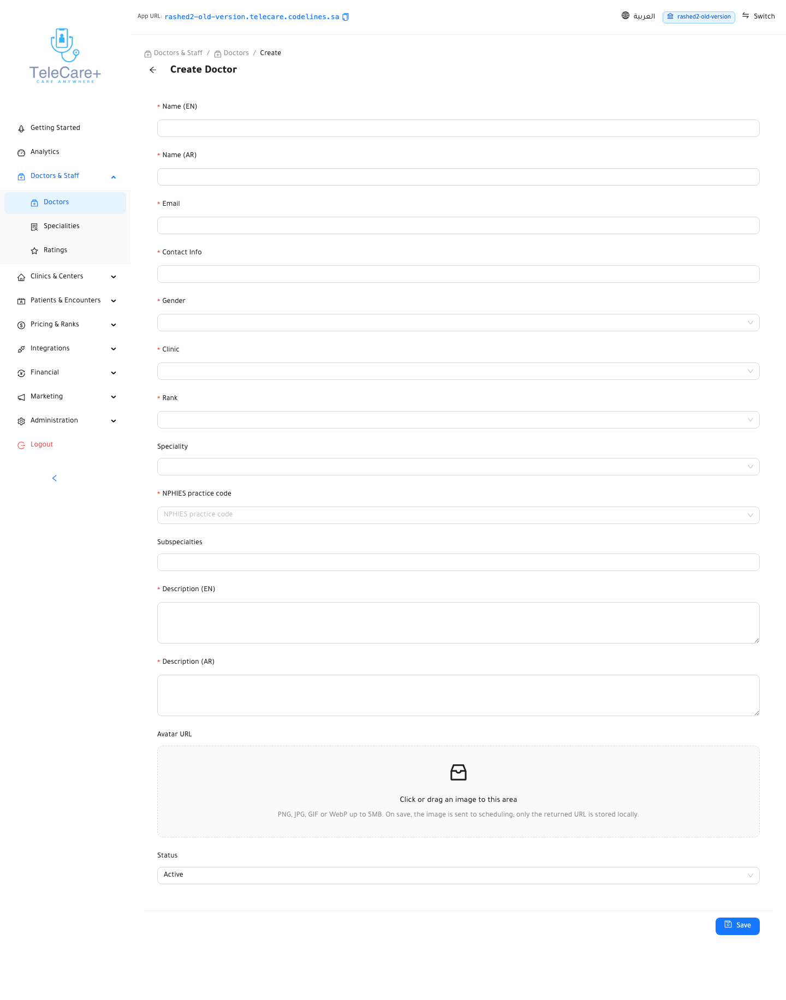

Fields you fill in:

- **Name (English)** and **Name (Arabic)**.
- **Email**, **Contact info** (phone), **Gender**.
- **Clinic**, **Doctor Level**, **Speciality** — picked from the dropdowns you set up earlier.
- **Insurance practice code (NPHIES)** — required only if you submit insurance claims.
- **Subspecialties**, **Description** (English + Arabic), **Avatar** photo, **Status** (Active / Inactive).

> A **Location** section (latitude, longitude, service radius) may appear if your clinic also dispatches doctors to patient locations. Leave it off when this doctor only sees patients online or at your clinic.

### 5.2 Specialities

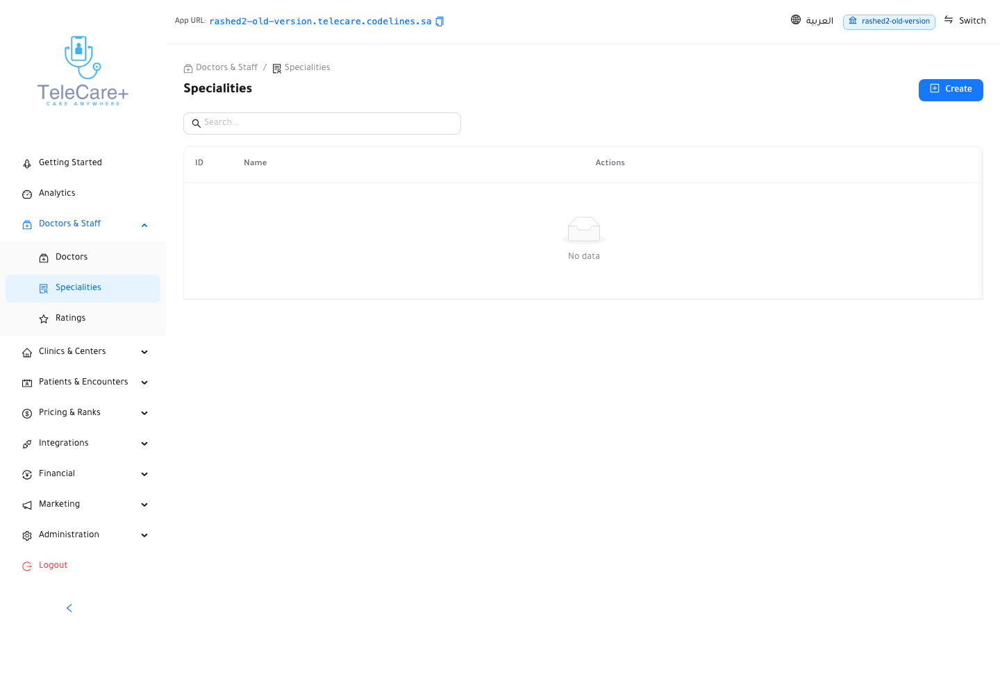

The list of medical specialities you offer. The patient app uses this list when patients filter for the doctor they need.

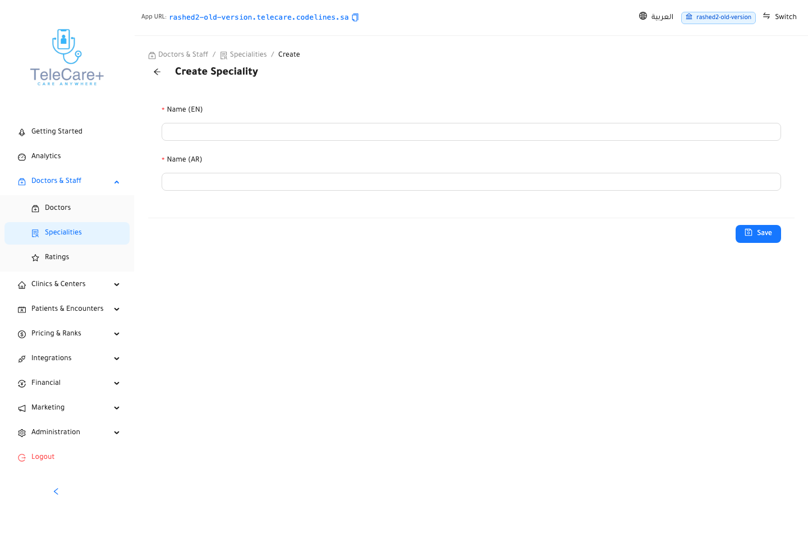

- Just two fields: **Name (English)** and **Name (Arabic)**.
- Add one entry for every speciality your doctors cover.

### 5.3 Ratings

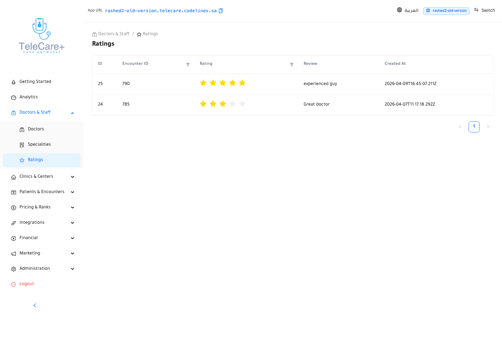

What patients said after their appointments. Each row shows the appointment ID, the star rating, the patient's review text, and the date.

- Use the column filters to find ratings for a particular appointment or score.
- This screen is **read only** — patients submit the reviews, and you can read but not change them.

---

## 6. Clinics & Centers

### 6.1 Clinics

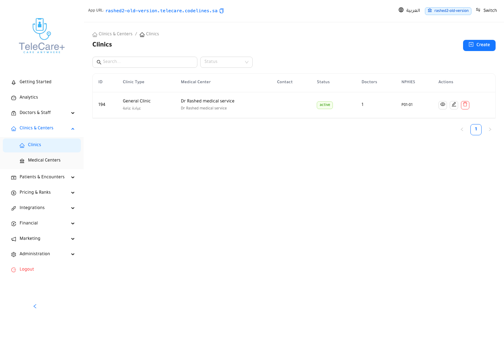

A "clinic" is one department inside a medical center — for example "General Medicine — Telecare HQ". Each row shows the clinic type, the medical center it belongs to, contact number, status, doctor count, and insurance code status.

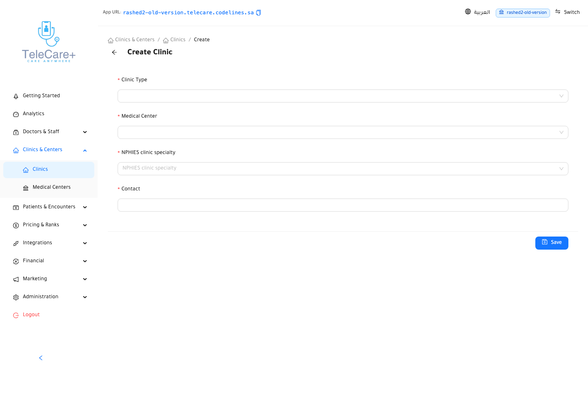

- **Clinic type** — pick from the list you created during setup.
- **Medical center** — the parent facility.
- **Insurance specialty code** — used when sending claims.
- **Contact number** — for patients and partners.

The buttons on each row let you **view**, **edit**, or **delete** the clinic.

### 6.2 Medical Centers

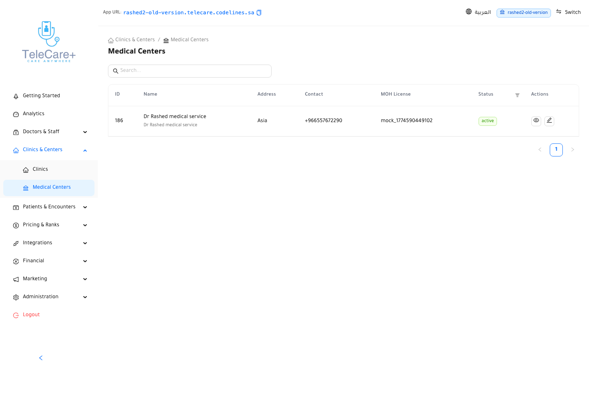

The top-level facilities under your account — usually one per branch / city.

- The list shows the bilingual name, address, contact, MOH license number, and status.
- Edit a center to update its name (English + Arabic), address, MOH license, official phone, official email, website, logo, **digital stamp** (used on printed prescriptions and lab orders), location, and status.

> The **MOH license** and **digital stamp** are what make your prescriptions and reports official — they appear on every PDF the clinic produces, whether the visit was online or in-person. Keep both up to date.

---

## 7. Patients & Appointments

### 7.1 Patients

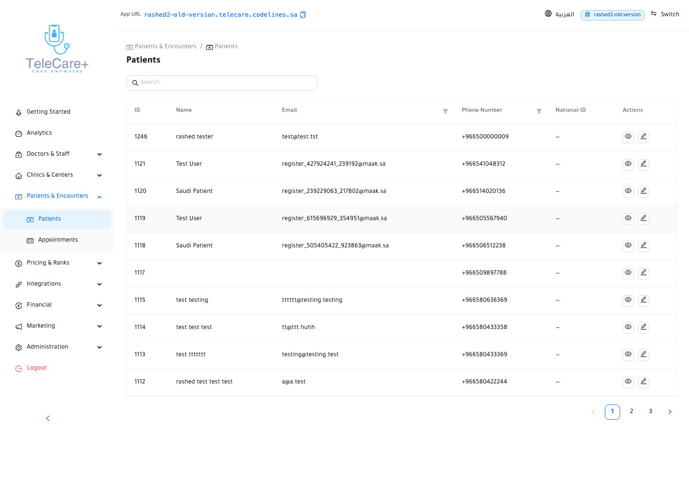

The list of patients registered in your system.

- Columns: ID, English name, email, phone, national ID.
- Filter by email or phone with the small column dropdowns; the top **search** does a free-text match across name and contact info.
- Click the **eye icon** to see the full profile, or the **pencil icon** to edit name, email, phone, national ID, or add a free-form note.

> Patients register themselves through the patient mobile app. The dashboard is mostly for viewing — keep your edits limited to corrections.

### 7.2 Appointments

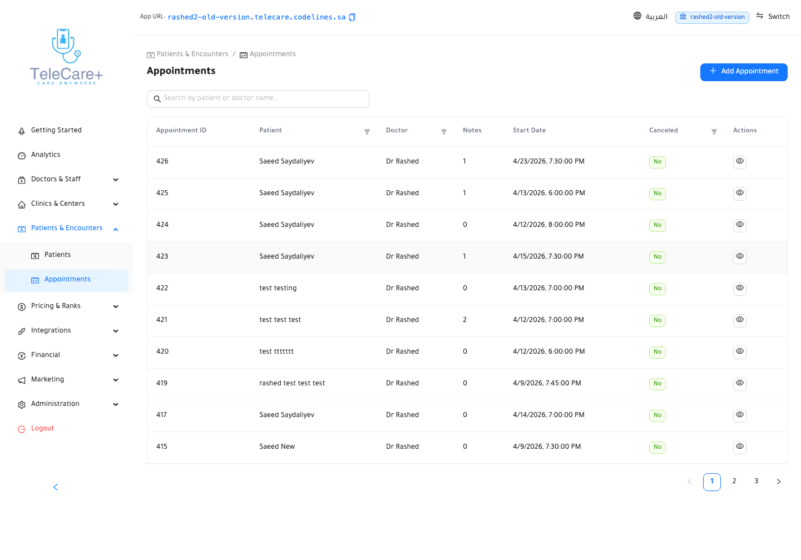

Every booking — past, present, and future. The list shows ID, patient name, doctor name, the number of clinical notes on file, start time, and whether it's canceled.

- Filter by patient, doctor, or status (Confirmed / Canceled) using the column dropdowns. The top **search** finds appointments by patient or doctor name.
- **+ Add Appointment** opens a window where you can pick an available doctor and book a slot on their calendar on the patient's behalf.
- Click an appointment to open its **details page**. From there you can:
  - **View Booking Details** — see the full booking record.
  - **Reschedule** — open the doctor's calendar pre-set to this appointment so you can pick a new slot.
  - **Cancel Booking** — type a reason and confirm.
  - **Prescriptions** and **Lab Investigations** tabs — see what the doctor prescribed or ordered during this appointment.

> **Online consultations:** the patient and the doctor join the call from their own mobile apps — the dashboard isn't used for the call itself, only for booking and follow-up.
>
> **In-person appointments:** the patient comes to your clinic at the scheduled slot. Use the dashboard to confirm the booking, reschedule if needed, and review what the doctor recorded afterwards.

---

## 8. Pricing

### 8.1 Doctor levels

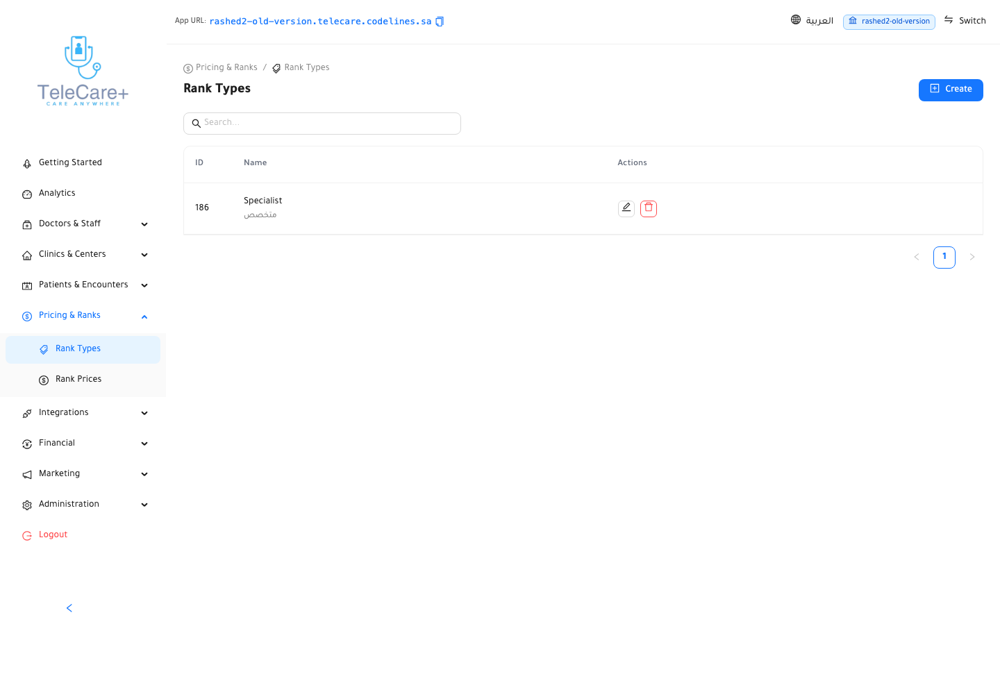

The seniority tiers you charge differently for — for example Consultant, Specialist, GP.

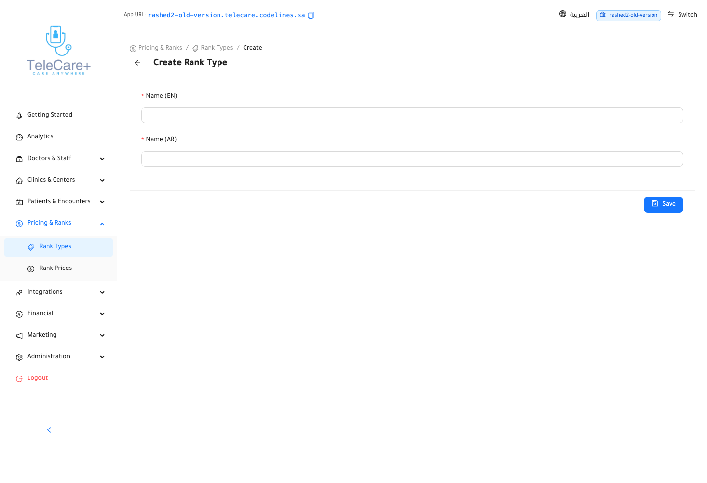

- Fields: **Name (English)** and **Name (Arabic)**. Nothing else.

### 8.2 Prices

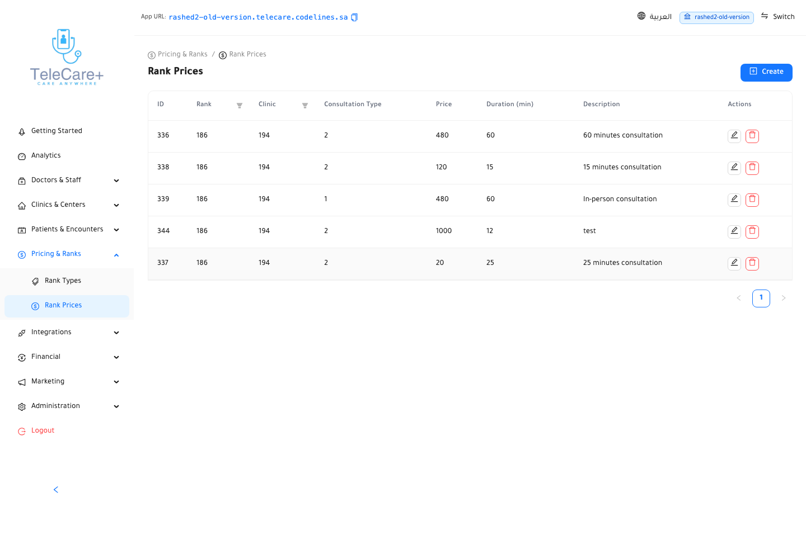

The price list: one entry per (doctor level × clinic × consultation type). Set a different price for online and in-person if you charge differently. For example, "Cardiology consultant — video — 30 minutes — 250 SAR" and "Cardiology consultant — in-person — 30 minutes — 350 SAR".

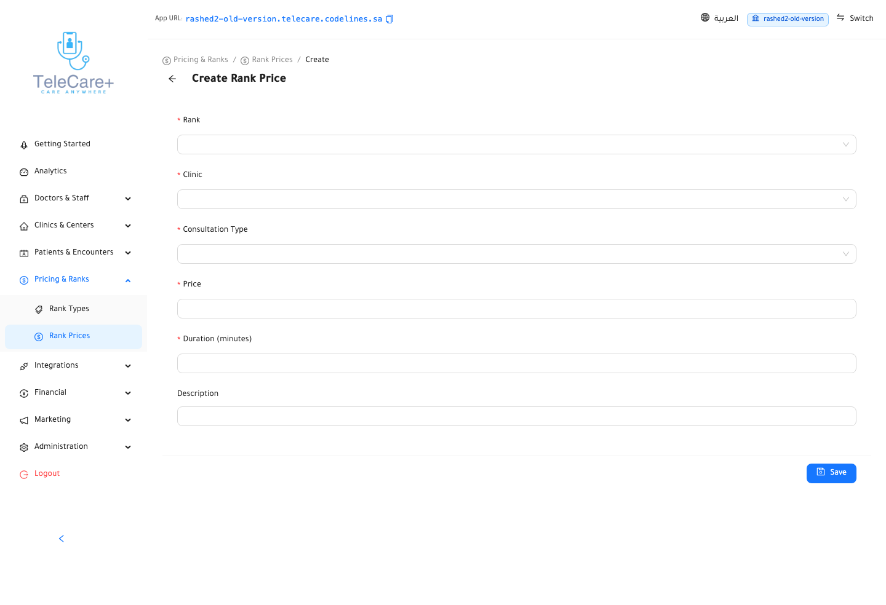

- **Doctor Level**, **Clinic**, **Consultation Type** — pick from the dropdowns.
- **Price** in your currency.
- **Duration (minutes)** — how long the slot is. This sets the appointment length on the doctor's calendar.
- **Description** — what the patient sees next to the price in the booking app.

> Some clinics are set up so the patient just picks the cheapest available doctor (without choosing a level). On those clinics the **Doctor Level** field is hidden — the system picks automatically.

---

## 9. Integrations

These two pages let you configure parts of the booking platform that power your patient and doctor apps. The first time you open one, give it a few seconds to load.

### 9.1 Apps

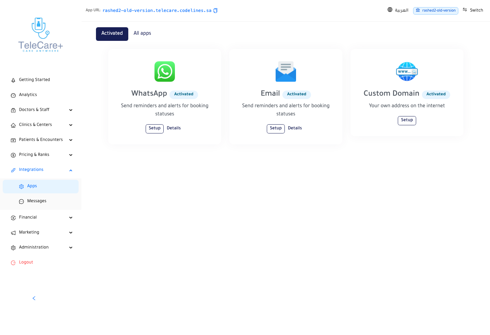

Turn on or off the **add-ons** that extend your clinic — for example payment providers, notification channels, or custom integrations.

### 9.2 Messages

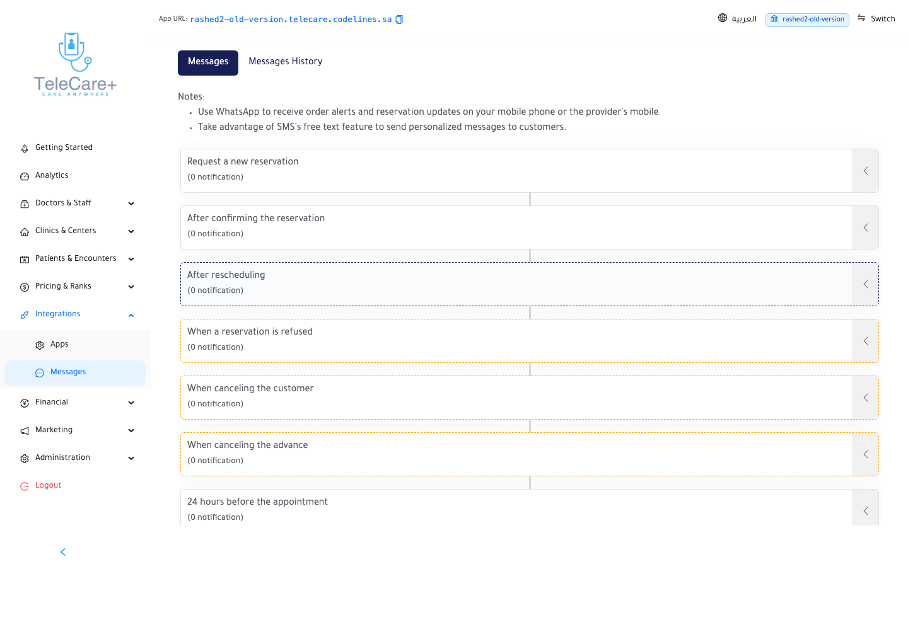

Set up the **SMS, email, and WhatsApp templates** your clinic sends — appointment reminders, confirmations, follow-ups.

---

## 10. Money

### 10.1 Invoices

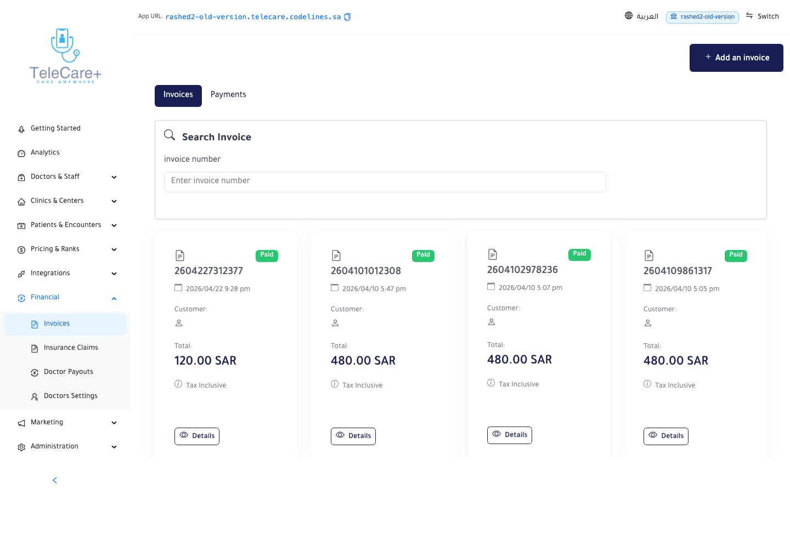

Issue invoices, view what's paid and what's still pending, and attach invoices to appointments.

### 10.2 Insurance Claims

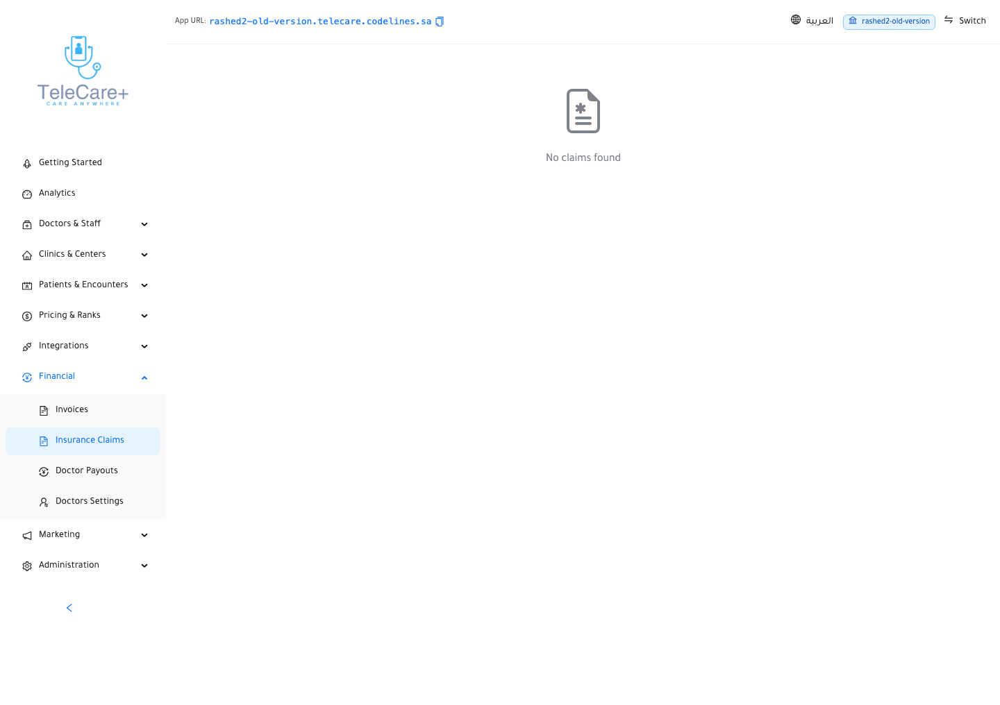

Submit and track insurance claims through the Saudi national health insurance network (NPHIES) — eligibility checks, pre-authorizations, and reimbursements.

> Claims won't work without two things: the doctor's **insurance practice code** and the clinic's **insurance specialty code**. The ⚠️ icons on the Doctors and Clinics lists tell you which ones are missing.

### 10.3 Payouts

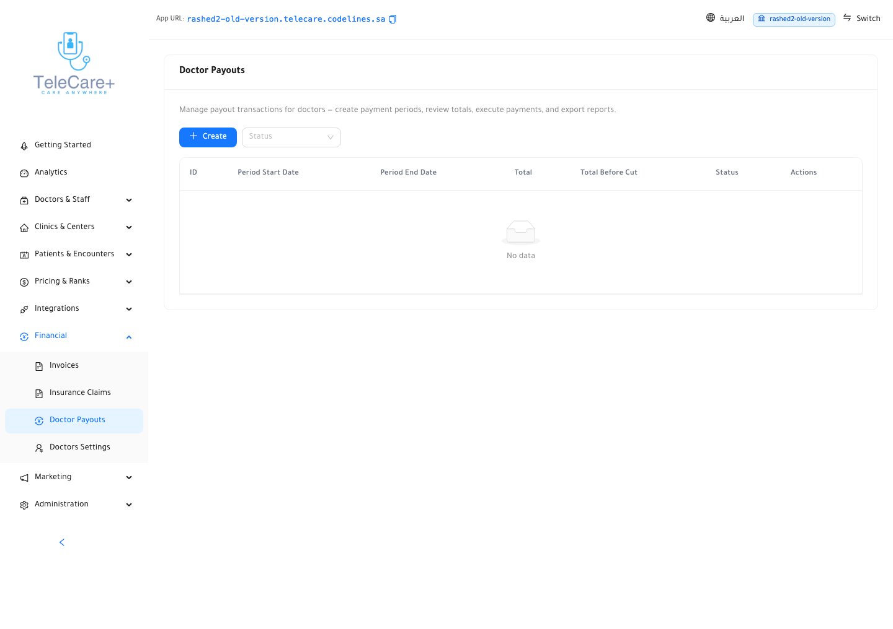

Batch payments to your doctors. Each row is one payout for a date range.

- Columns: ID, period start, period end, total, total before your cut, status.
- **Status** is one of Draft, Processing, Completed, Failed, or Cancelled. Use the filter to narrow down. Click **Load More** for older batches.
- **Create** opens a window where you pick the start and end dates and creates a **draft** payout.
- Click a row to open the details:
  - **Execute** — only available for draft batches; this actually sends the money.
  - **Cancel** — only available for draft batches.
  - **Export Excel** — completed batches can be exported as a spreadsheet.

### 10.4 Provider Settings

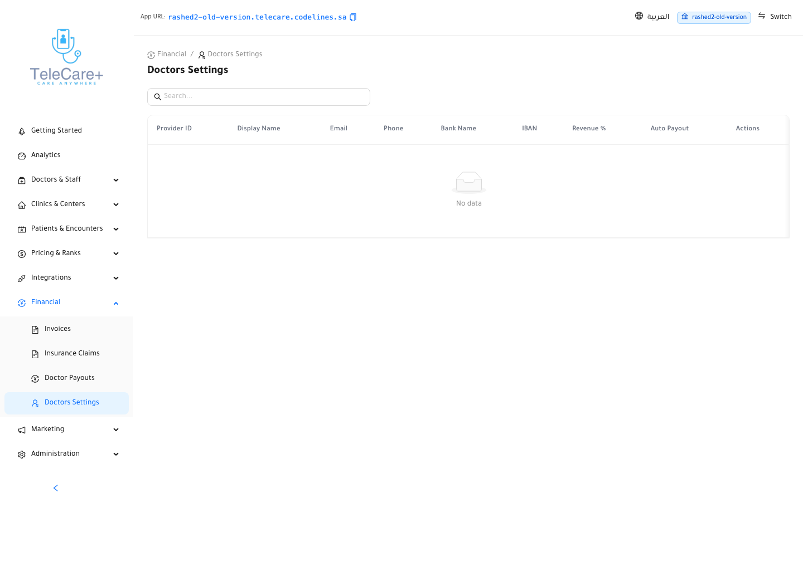

The payment setup for each doctor.

- Columns: ID, name, email, phone, bank name, IBAN, your revenue share, and whether payouts run automatically.
- Edit a row to set:
  - **Bank Full Name** and **IBAN** — where the money goes.
  - **Revenue Percentage** — the share each doctor takes home (between 0 and 1; for example **0.7** means **70%** to the doctor and **30%** to the clinic).
  - **Automated Payout** — turn on if you want payouts to fire automatically at the end of each period.

Doctors appear here automatically once you've added them; you don't add or remove entries from this page directly.

---

## 11. Marketing

### 11.1 Coupons

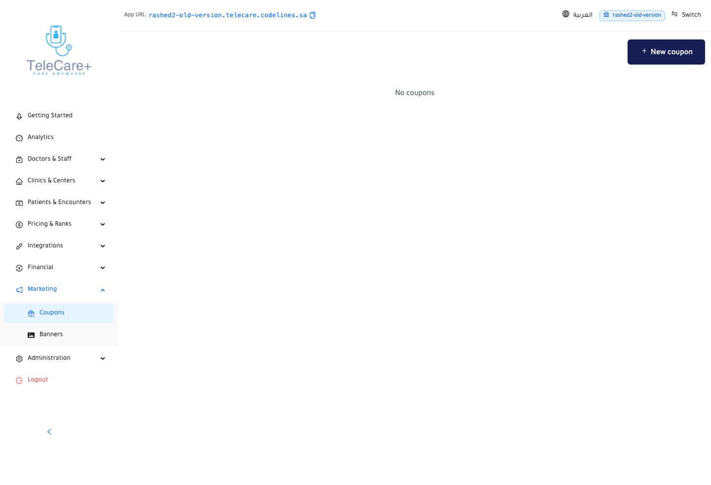

Create discount codes — set the amount, the dates they're valid, and which clinics or services they apply to.

### 11.2 Banners

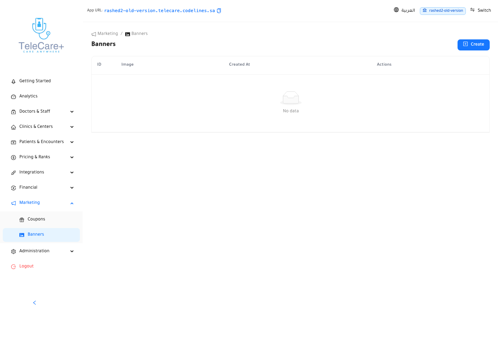

The big promotional images on the patient app's home screen.

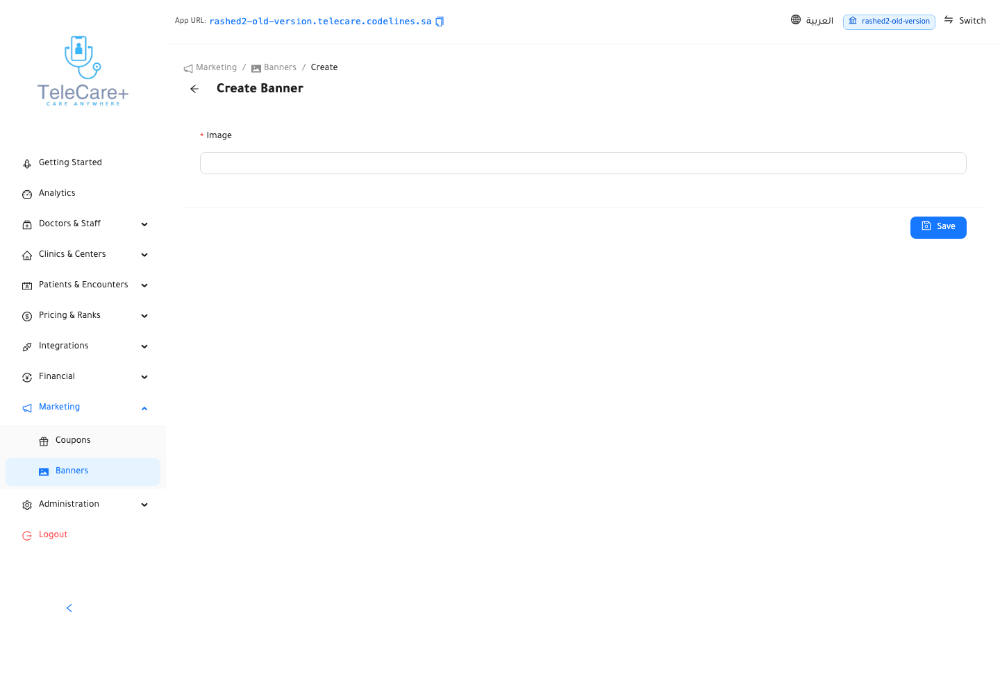

- One field: **Image URL**.
- The list shows a thumbnail of each banner. To reorder, delete and re-add — the latest banner appears last.
- Use it for campaigns, seasonal offers, or service announcements.

---

## 12. Team Administration

### 12.1 Users

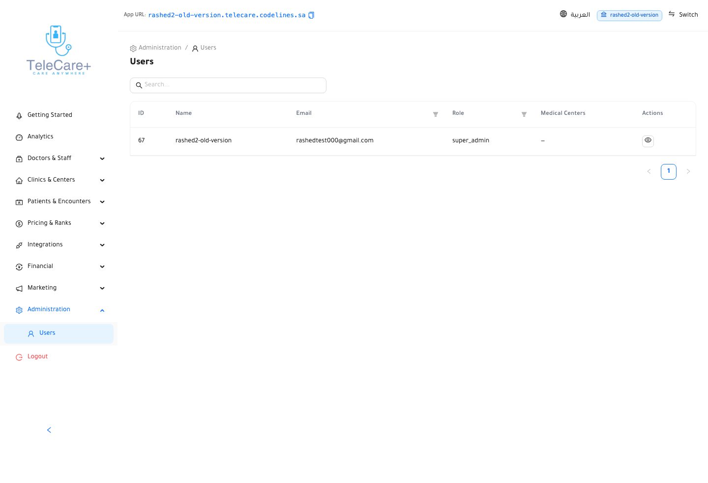

Your team — everyone who can sign into this dashboard.

- Columns: name, email, role, and the medical centers they can access.
- The top **search** finds people by name; the column filters narrow by email or role.
- Click the **eye icon** to see a user's full profile.

> This page is **view only**. To invite a new admin or revoke an existing one, contact Codelines support. The roles you'll see are:
>
> - **Owner (root_admin)** — full access across the whole clinic group.
> - **Manager (super_admin)** — manages a group of medical centers.
> - **Center admin (medical_center_admin)** — limited to one specific medical center.

---

## 13. Forgot your password?

### Step 1 — Request a reset link

- From the sign-in page, click **Forgot Password?**.
- Type your email and submit. You'll see a confirmation message; an email with a reset link will arrive in your inbox.

### Step 2 — Set a new password

- Open the link in your email — it takes you to a page with two boxes: **new password** and **confirm**.
- Pick a password at least **6 characters** long, type it twice, and submit.
- You'll be sent back to the sign-in page with a green confirmation banner.

If the link in your email says "invalid token", request a new one from the Forgot Password page.

---

## 14. Quick tips

- **English ↔ Arabic anywhere.** The globe icon in the top-right switches the whole dashboard between languages and flips the layout for Arabic.
- **Switch between clinics.** The dropdown at the top-right of every page lists the clinics your account can access.
- **Patient app URL.** The top of every page (left of the header) shows the public address of your patient-facing app, with a copy button next to it. Useful when training new staff or sharing the link with patients.
- **Unsaved changes.** If you edit something and try to leave the page without saving, the dashboard will ask you to confirm.
- **Where prescriptions and lab orders live.** They're not in the sidebar on their own — your doctors create them in their doctor app, and you'll find them on each Appointment's details page under the **Prescriptions** and **Lab Investigations** tabs. You can download them as PDFs from there.
- **Watch for the ⚠️ icon.** It always means an insurance code is missing on a doctor or clinic. Fill it in before you submit claims.
- **Need help?** Contact Codelines support — they can adjust account access, add team members, or assist with anything you can't do from the dashboard yourself.
